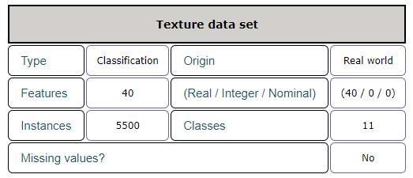
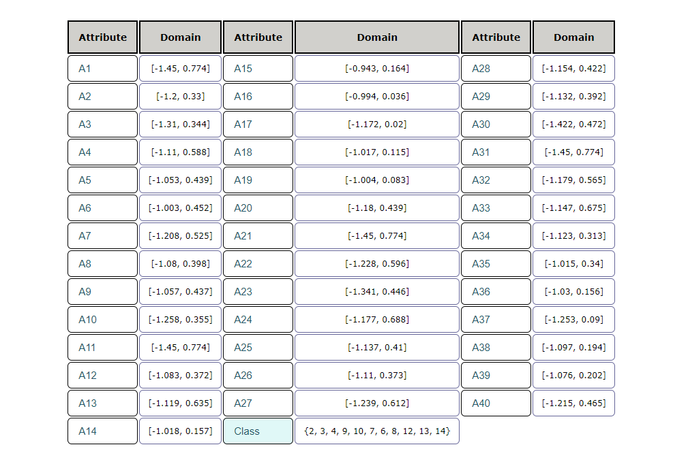

# Класификација текстура
Тема пројектa  је тренирање неуронске мреже за класификацију 11 текстура.

## Неуронска мрежа
Неуронска мрежа је један облик имплементације система вештачке интелигенције, који представља систем који
се састоји од одређеног броја међусобно повезаних процесора или чворова које називамо неуронима.
Сваки неурон има локалну меморију у којој памти податке које обрађује, и ти подаци су углавном
нумерички. Да би се створила неуронска мрежа, потребно је креирати њену архитектуру, односно специфично
повезивање неурона у једну целину. Структура неуронске мреже се разликује по броју слојева и најчешде их
има три. Први слој се назива улазни, последњи слој представља излазни, док се слојеви између називају скривени
слојеви. Улазни слој прима податке из спољашње средине, скривени слојеви прослеђују
релевантне податке излазном слоју који на крају даје коначни резултат.

Битно је напоменути да сложеније неуронске мреже имају више скривених слојева и да су сви слојеви
међусобно потпуно повезани. Комуникација између слојева је таква да се излаз сваког неурона из
претходног слоја повезује са улазима свих неурона наредног слоја и јачина тих веза се назива тежински
фактор (weight).

Кратка подела односно класификација неуронских мрежа може бити следећа:
1. Према броју слојева
а. Једнослојне
б. Вишеслојне
2. Врсти веза између неурона
3. Врсти обучавања неуронских мрежа
4. Смеру простирања информација
а. Неповратне 
б. Повратне
5. Врсти података

Неуронска мрежа се може реализовати на два начина:
1. Хардверска реализација (физичко повезивање чворова)
2. Софтверска реализација (логичко – виртуелно повезивање слојева)

У пројекту је коришћена вишеслојна неуронска мрежа неповратног типа. Остали параметри мреже биће
детаљно описани у наставку рада.

## Припрема података
Одмах на почетку је потребно обрадити улазне податке и уједно их спремити за даљу примену – рад са
њима. Како је и горе наведено, потребно је на основу одређених података (параметара) истренирати
неуронску мрежу тако да разликује између 11 различитих текстура.

Слика 2 – Преглед сета података

Подаци су састављени од 40 атрибута (параметара) као и 11 могућих класа текстура. Података укупно има
5500 , при том немамо податке без вредности. Важно је само напоменути да су подаци ‘преузети’ из
реалног света.

Сваки од атрибута има своја предефинисана могућа стања – вредности. У наставку се могу видети сва
могућа стања (вредности) за сваки атрибут појединачно.

Слика 3 – Преглед атрибута и његових могућих вредности

